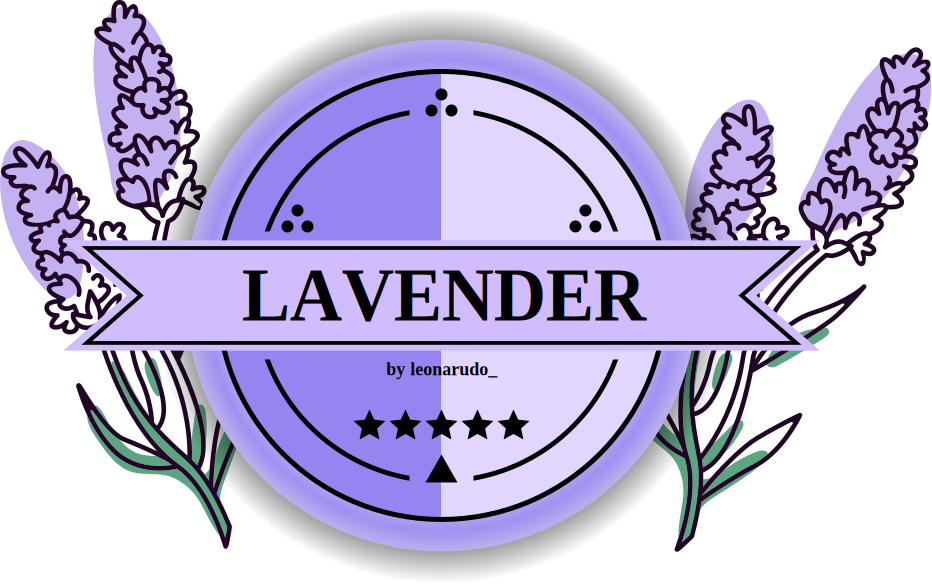

  

**Lavender** is a powerful and user-friendly library mod designed to simplify the process of modding the game [Obenseuer](https://store.steampowered.com/app/951240/Obenseuer/) using BepInEx as mod loader.
## Nuget
- **.Net CLI:** ``dotnet add package Lavender --version 0.2.0``
- **PackageReference:** ``<PackageReference Include="Lavender" Version="0.2.0" />``

## Features:
- Furniture
  - Assets either via AssetBundles or OBJ & JPG/PNG
  - Custom Scripts
  - add to Shops
- Item
  - Assets either via AssetBundles or OBJ & JPG/PNG
  - Just like the native Items.json
- Recipe
  - Just like the native Recipe.json
- Developer Console
  - Simply add new Console Commands
### Additional:
- Runtime OBJ Importer
- easy PNG/JPG Loader

### Upcoming:
[CHANGES.md](./CHANGES.md#upcoming)
 
## Contributing
Contributions are welcome! Whether you're fixing bugs, adding new features, or improving documentation, your help is appreciated. To contribute, please fork the repository and submit a pull request. For major changes, please open an issue first to discuss what you would like to change.

Here are some basic resources on code style and naming conventions Lavender trys to fulfill:
- [Coding Conventions](https://learn.microsoft.com/en-us/dotnet/csharp/fundamentals/coding-style/coding-conventions)
- [Identifier Names](https://learn.microsoft.com/en-us/dotnet/csharp/fundamentals/coding-style/identifier-names)

## License
This project is licensed under the [LGPL-v2.1 license](LICENSE)
 
